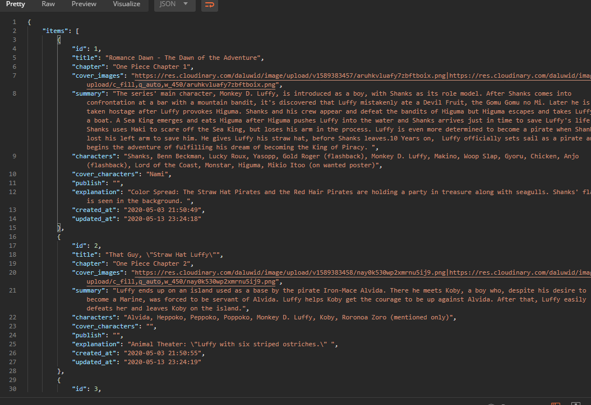

# PHP API Assignment

The goal of this assignment is to make calls to an API and display then returned data in the browser. The API I have chosen is [One Piece Manga](https://onepiececover.com/api/chapters). The API for this project does not require `Auth`. 

## Installation

````bash
$ git clone https://github.com/jia-von/php-api-assignment.git
$ cd php-api-assignment-jia-von
$ php -S localhost:80
``````

## Methodology

- I retrieved a response from the API.
- Converted JSON object into a PHP object/array for the returned data.
- I created a webpage to render the returned data with Title and Summary of One Piece Manga. 

### Screenshot shown in [Postman](https://www.postman.com) API Developer



### Screenshot as shown in the browser


